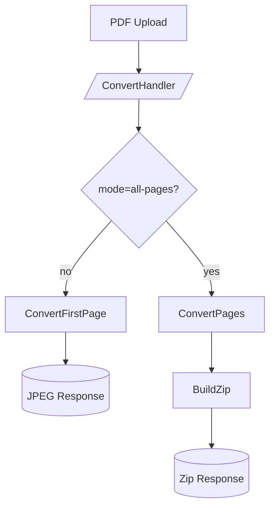

## はじめに

PDFを画像に変換する処理は、Webサービス開発において頻繁に求められる機能の一つです。今回は、外部APIの有料化をきっかけに、Goと言語とCloud Runを用いて自前で「PDF to JPEG 変換 API」を構築した際の知見を共有します。

## 作成のきっかけ

これまで無料枠で利用していた外部の PDF to JPEG 変換 API が、突如として有料プランのみに変更されました。
もともと GAS（Google Apps Script）を用いて、ECサイト向けの資料アップロードを自動化する一環でそのAPIを利用していましたが、変換機能が止まったことでワークフロー全体が破綻してしまいました。

「外部サービスに依存し続けるのはコスト的・運用的にリスクがある」と判断し、**「シンプルかつ低コスト、かつスケールしやすい変換API」**を自作することにしました。

## 技術選定

今回のプロジェクトでは、以下の技術スタックを採用しました。

- **言語**: **Go**
  - 普段から使い慣れていることに加え、単一バイナリにまとめやすく、Cloud Run との相性が抜群であるため採用。
- **変換ライブラリ**: `github.com/gen2brain/go-fitz`
  - MuPDF のバインディングです。レンダリング品質が非常に高く、他のライブラリと比較してもPDFの再現性が優れていたのが決め手でした。
  - ネイティブ依存（C言語ライブラリ）が必要なため、Dockerfile 内で `mupdf`, `libjpeg`, `libopenjp2` などをビルド・インストールしています。
- **ホスティング**: **Cloud Run**
  - 基本的にステートレスな設計にし、リクエストがあった時だけ起動させることで運用コストを最小化。
- **認証/データベース**: **Firestore & Secret Manager**
  - 固定のシステム連携用キーに加え、Firestore ベースの一時キーを併用。Firestore は無料枠が大きいため、月間数百件程度の個人・小規模運用ならほぼ無料で収まります。

## 実装のステップ

### 1. 単ページ変換の MVP 開発

まずは、`POST /convert` にアップロードされた PDF の 1 ページ目だけを JPEG にして返す最小機能を実装しました。10MB の容量制限、API キー認証、処理後の一時ファイル削除といった基本機能を盛り込んでいます。

```go:internal/service/converter.go
// 最初の1ページのみを変換するロジックの抜粋
jpegBytes, err := svc.ConvertFirstPage(r.Context(), tempPath)
if err != nil {
    writeJSONError(w, http.StatusInternalServerError, "failed to convert pdf")
    return
}
```

### 2. 複数ページ対応と Zip アーカイブ

次に、複数ページに渡る PDF を一括変換したいというニーズに対応しました。
リクエストパラメータに `mode=all-pages` を追加し、全ページを `{basename}_page-001.jpg` のような連番形式で Zip に固めてレスポンスするようにリファクタリングしました。

全体の処理フローを Mermaid で表すと以下のようになります。



### 3. Docker とテスト環境の整備

ネイティブライブラリに依存するため、開発環境の差異をなくすべく Docker 構成を工夫しました。Firestore エミュレータを同梱した `docker-compose.yaml` を用意し、ローカルで完結するテスト環境を構築しています。

:::message
`.env.docker` ファイルで環境変数を一元管理し、アプリケーションとエミュレータの両方で読み込んでいます。
:::

```yaml:docker-compose.yml
services:
  firestore-emulator:
    image: google/cloud-sdk:emulators
    env_file: .env.docker
    ports:
      - "8301:8300"
  app:
    build: .
    env_file: .env.docker
    ports:
      - "8300:8300"
    depends_on:
      - firestore-emulator
```

また、`test/fixtures/` にテスト用PDFを配置し、単ページ変換、マルチページ変換、Zip解凍後の内容検証までを自動テストでカバーしています。

## リポジトリ

ソースコードはすべて GitHub で公開しています。詳細なセットアップ方法や API の仕様については、README を参照してください。

https://github.com/ttokunaga-jp/pdf2jpg

:::details コードの核となる部分を確認したい場合
ハンドラ内での詳細なモード分岐ロジックは、以下から参照いただけます。
https://github.com/ttokunaga-jp/pdf2jpg/blob/main/internal/handler/convert_handler.go#L43-L139
:::

## おわりに

外部 API の有料化は開発者にとって頭の痛い問題ですが、Go と Cloud Run を組み合わせることで、非常に低コスト（あるいは無料枠内）で高性能な代替手段を構築することができました。

同じように「PDF 変換 API のコストを抑えたい」「自前でセキュアに管理したい」と考えている方の参考になれば幸いです！
